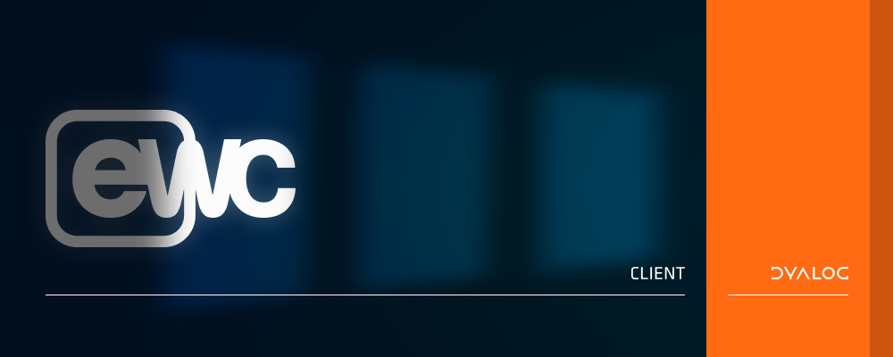

# ewc-client

The frontend for **EWC** — the browser half of a `⎕WC`-workalike GUI for Dyalog APL.
An application creates GUI objects through EWC's `eWC` family on the
[**ewc**](https://github.com/dyalog/ewc) APL server; this repository renders what the
server describes as React components, and reports user events back.

## Using EWC

You don't need this repository to *use* EWC. Each release bundles the built frontend,
so grab one from the server repo:

- **Releases:** <https://github.com/dyalog/ewc/releases>
- **Documentation:** [EWC User Guide](https://dyalog.github.io/ewc/latest/)

## Developing the ewc-client

To work on this repository itself:

1. Clone [`ewc`](https://github.com/dyalog/ewc) and `ewc-client` next to each
   other, so the server picks up your local build automatically:

        /my/dev/directory/ewc
        /my/dev/directory/ewc-client

2. Install dependencies and point the frontend at a running server (default WebSocket
   port `22322`):

        yarn install
        cp .env.example .env.development

3. Start the Vite dev server (hot reload on port `5173`):

        yarn dev

4. In your APL session, switch the demo to browser mode:

        demo.Run 'Browser'

   then open <http://localhost:5173> — it connects back to the server over `:22322`.

## Contributing

Development happens on `main`; open pull requests against `main`. See
[CONTRIBUTING.md](CONTRIBUTING.md) for conventions, testing, and how this repository
relates to the `ewc` server.
