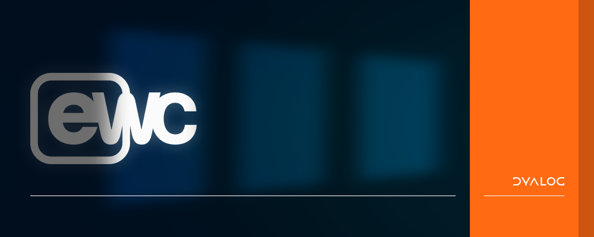

# EWC



EWC ("Everywhere Window Create") is a cross-platform implementation of Dyalog APL's
`⎕WC` GUI family, currently a growing subset of `⎕WC`'s functionality. 

It lets a `⎕WC` application run outside Windows — on Linux, macOS or Windows — either in
a desktop window or in a browser. The supported subset grows with the needs of early
adopters; see the [object reference](https://dyalog.github.io/ewc/latest/ObjectRef/Classes/) to check what is covered.

> **Status:** EWC is under active development and not yet supported through normal Dyalog channels.

## Requirements

- Dyalog APL Unicode **18.2 or later**
- **Desktop mode** needs the HTMLRenderer — currently Linux, macOS and Windows
- **Browser modes** run on any Dyalog-supported platform

## Quick start

1. **Get EWC.**

   **To use EWC**, download the latest
   [release](https://github.com/dyalog/ewc/releases) and unpack it. A release bundles a
   matching prebuilt JavaScript client, so this is all you need — no Node.js, no build
   step, no second repository.

   **To develop EWC**, clone *both* repositories side by side, in the same parent folder
   and with these exact names, so the server picks up your local client build
   automatically:

        git clone https://github.com/dyalog/ewc.git
        git clone https://github.com/dyalog/ewc-client.git

   Then build the client once (`cd ewc-client && yarn install && yarn build`). See
   [CONTRIBUTING.md](CONTRIBUTING.md) for the full development workflow.

2. **Start Dyalog APL** and link the folder:

        ]link.create # /path/to/ewc

3. **Run the demo** to check everything works:

        demo.Run 'Desktop'

   You get a form with a dropdown of sample applications (about 100 of them). The source
   for each is the function `demo.DemoXXX`, where `XXX` is the name in the dropdown.

Then build your own:

```apl
EWC.Init 'Desktop'
'F1' eWC 'Form' 'Hello World' (10 10) (400 600)
```

`EWC.Init` creates `eWC`, `eWS`, `eWG`, `eWN`, `eNQ`, `eEX` and `eDQ` in the calling
namespace — EWC's workalikes for `⎕WC`, `⎕WS`, `⎕WG`, … They reimplement the same
interface rather than wrapping the system functions, so you call them instead of, not
alongside, the originals. A left argument changes the prefix (`'x' EWC.Init 'Browser'`
gives `xWC`, `xWS`, …).

> Using `]link.import` instead of `]link.create` (or running without .NET / a file system
> watcher)? Also set `EWC.FOLDER←'/path/to/ewc'`.

## Releases

Releases are tagged `vX.Y.Z` and published on the
[releases page](https://github.com/dyalog/ewc/releases); the notes for each one live in
[RELEASES.md](RELEASES.md).

Every release includes `client/dist/` — a prebuilt copy of the
[ewc-client](https://github.com/dyalog/ewc-client) React client — so a release is
self-contained. You don't need Node.js, a build step, or a separate client checkout to
use EWC.

## Modes

`EWC.Init` (and `demo.Run`) take the mode as a right argument:

| Mode | Behaviour |
|---|---|
| `'Desktop'` | Each form gets its own HTMLRenderer window — closest to `⎕WC`. |
| `'Browser'` | The server serves the client and listens on port `22322` (configurable); one browser session, so effectively a single form. |
| `'Multi'` | Experimental. Multiple browser sessions; the application namespace is cloned per connection (`demo_1`, `demo_2`, …) so each has its own state. Requires the `e` prefix, and an `Initialise` function to build the GUI per session. |

## Documentation

The [**EWC User Guide**](https://dyalog.github.io/ewc/latest/) is the full documentation.
Useful starting points:

- [Installation](https://dyalog.github.io/ewc/latest/Usage/Installation/) and
  [initialisation](https://dyalog.github.io/ewc/latest/Usage/Initialisation/)
- [Configuration](https://dyalog.github.io/ewc/latest/Usage/Configuration/) — port,
  folders, resources, logging
- [Supported classes](https://dyalog.github.io/ewc/latest/ObjectRef/Classes/) — per-class
  properties and events
- [EWC versus `⎕WC`](https://dyalog.github.io/ewc/latest/Discussion/Differences/) — known
  differences and limitations

If you are new to `⎕WC` itself, start with the standard Dyalog GUI documentation; the EWC
docs only describe where EWC differs.

## Related repositories

**EWC** is the project, and it is built from two repositories:

| Name | What it is |
|---|---|
| [**ewc**](https://github.com/dyalog/ewc) (this repo) | The APL server — implements the `eWC` family, owns each class's property and event contract, serves the frontend, ships the demos and this documentation. |
| [**ewc-client**](https://github.com/dyalog/ewc-client) | The frontend — a JavaScript/React app that renders the GUI objects the server describes and reports user events back. |

The two halves talk over a WebSocket (port `22322` by default). Not to be confused with
**`eWC`** — EWC's workalike for `⎕WC`, which `EWC.Init` creates in your namespace.

A built copy of the frontend ships in `client/dist/` and is refreshed at release time — so
**a release of this repository is all you need to use EWC**. If a sibling `ewc-client`
checkout is present, the server prefers that folder's `dist/` instead, which is what makes
the developer setup above pick up frontend changes automatically.

## Contributing

See [CONTRIBUTING.md](CONTRIBUTING.md) for how the project fits together and the
conventions we follow. Development happens on `main`; open pull requests against `main`.

## Licence

MIT (Dyalog Ltd.) — see [LICENSE](LICENSE).
